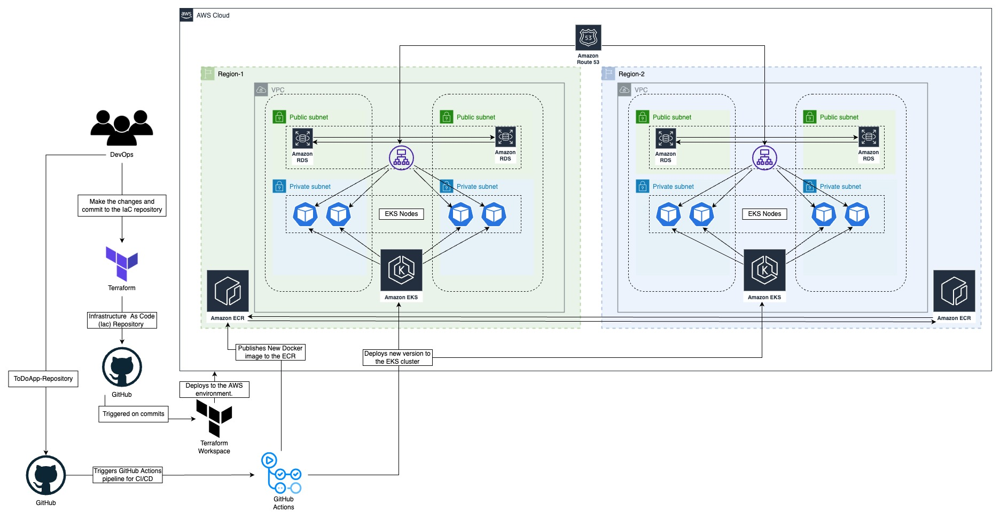

# WeTravel-EKS-tf-Infra

## Description:
* The following High-Level Design has been designed and provisioned with Terraform (IaC). 
* Below are the mentioned services and their names.
* The Infrastructure Repository is attached/integrated with Terraform workspace which is acting as 
middleware and performs all the terraform "Plans" and "Apply" to keep the integrity of the tf state file.

The deployed architecture is an Active/Active Multi-Region EKS cluster with Multi-AZ RDS databases 
deployed in each region (eu-central-1/ eu-west-2).

## Terraform-Modules-Infra:
|module    | tf-files.                          |
|----------|------------------------------------|
|   ECR    | 	Main.tf                         |
|   EKS    | 	AWSLoadBalancerController.json  |
|          |    Main.tf                         |
|          |    Output.tf                       |
|          |    Variables.tf                    |                                 
|   RDS    |    Main.tf                         |
|          |    Output.tf                       |
|          |    Variables.tf                    |
|   VPC    |    Main.tf                         |
|          |    Output.tf                       |
|          |    Variables.tf                    | 
|                                               |
|  Main.tf      |                               |
|  Output.tf    |                               |
|  README.md    |                               |
|  Variables.tf |                               |

## Note:
In order to remove this terraform stack for the AWS environment the resources being created by 
Elastic Kubernetes Service needs to be deleted first manually then perform TF Destroy.